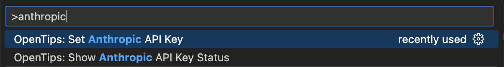

# Use Anthropic Claude

To use Anthropic's Claude as your language model provider:

1. Visit [Anthropic's website](https://www.anthropic.com) and sign up for an API key
2. In VS Code:
   - Open the Command Palette (Cmd/Ctrl+Shift+P)
   - Type "OpenTips: Set Anthropic API Key"
   - Press Enter
   - Paste your API key when prompted
3. Verify your setup:
   - Open the Command Palette again
   - Run "OpenTips: Show Anthropic API Key Status"
   - You should see a confirmation that the key is valid

Note: Your API key is stored securely in VS Code's secret storage and is never shared with any third parties.
