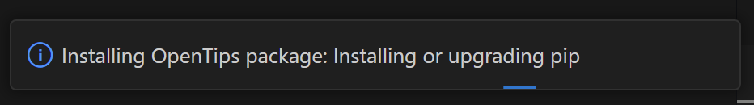

By default, OpenTips will automatically install the `opentips` package to `$HOME/.opentips`. 

## Automatic installer setting

You can disable this behavior by changing the setting "OpenTips: Install Globally" to "false".
Do this if you want to manually manage the `opentips` package in a virtualenv of your project
(the virtualenv must be located in `.venv` or `venv`).

## Installer command

You can initiate the automatic installer by running the command "OpenTip: Install opentips Python Package".
