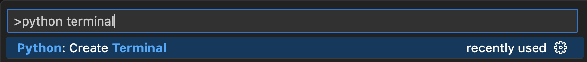

Once you've selected the Python interpreter, run the command `Python: Create Terminal` from the Command Palette `(Ctrl+Shift+P)` or `(Cmd+Shift+P)` to open a terminal with the selected Python interpreter:



From the terminal, install the `opentips` package using the following command:

```bash
pip install opentips
```

Now the OpenTips extension will detect that the package is available and it will run the RPC server in the background.

You can check the status of the server by checking the `Output` panel:


