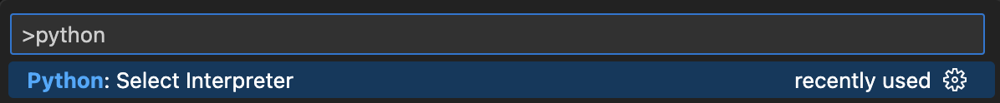
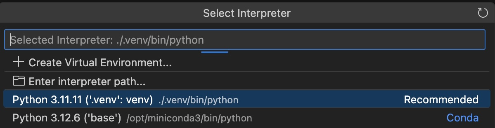
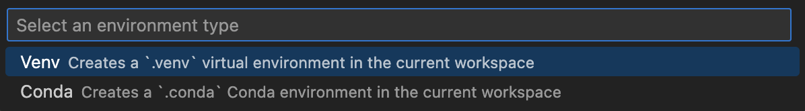

Run the Python extension command `Python: Select Interpreter` from the Command Palette `(Ctrl+Shift+P)` or `(Cmd+Shift+P)`:

Next, select the Python interpreter you want to use for this project:

If your project isn't a Python project, you probably won't have a Virtual Environment available.

Use the `Create Virtual Environment` button to create a new virtual environment, and select `Venv`.

