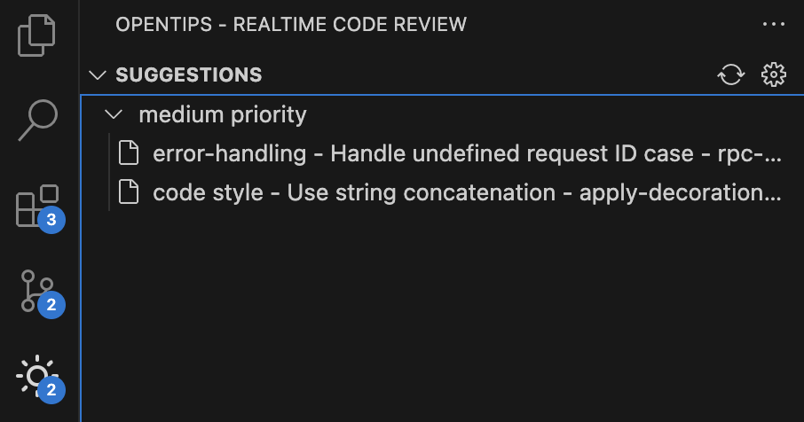

You can click on a tip in the OpenTips panel to view that tip in your code.

Once you've got a tip, there are three actions you can take:

- **Apply (`{}`)**: Click the Apply button to apply the tip to your code. This will automatically update your code to reflect the changes suggested by the tip.
- **Dismiss (🗑️)**: Click the Dismiss button to dismiss the tip. This will remove the tip from the OpenTips panel and you won't see it again.
- **Explain (`?`)**: Click the Explain button to see an explanation of the tip. This will help you understand why the tip is important and how it will improve your code.
